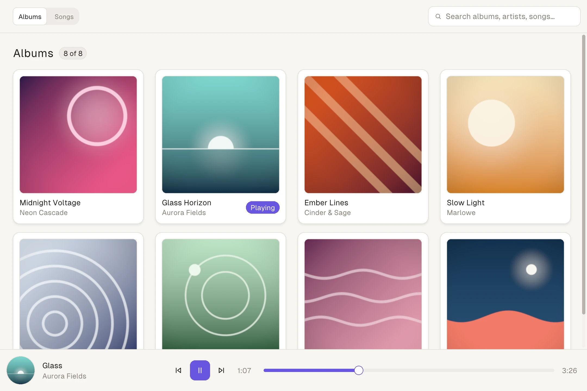
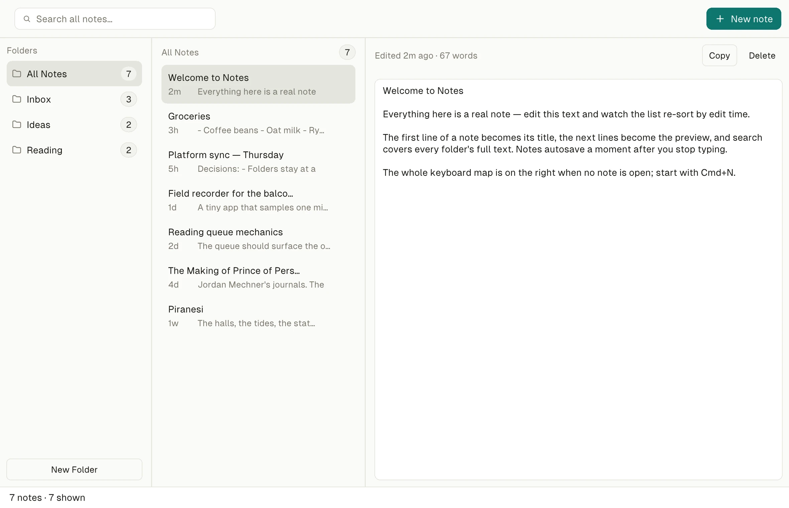
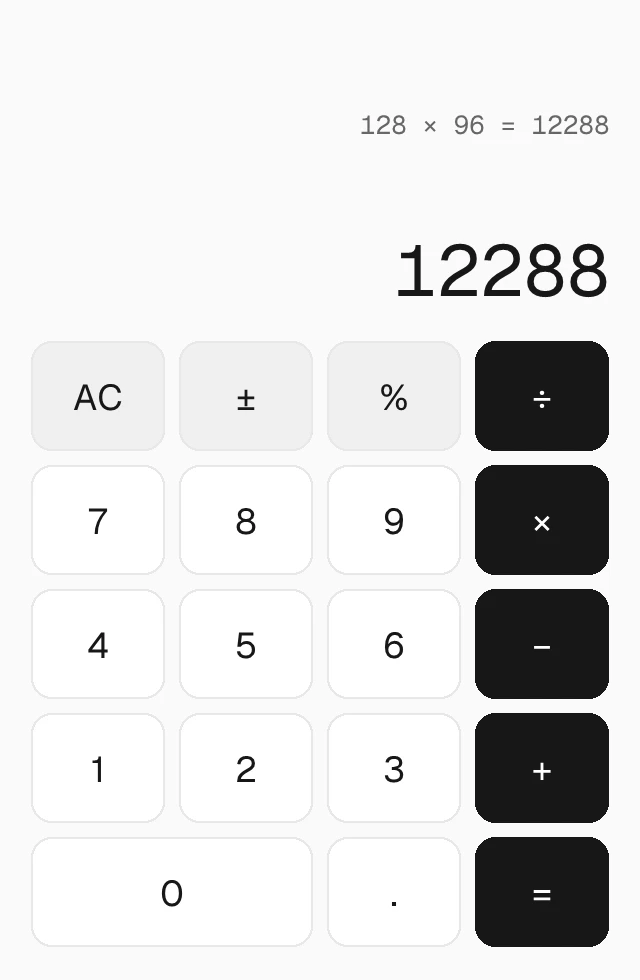

# Native SDK

**Native SDK is the complete toolkit for building native desktop applications.**

Native SDK exists because expressive UI and native performance should not be competing goals. Developers often choose web-based runtimes because they offer freedom, speed and control over the product experience. But that freedom often comes with a heavy runtime. Native SDK keeps the expressive authoring model and replaces the runtime with native rendering.

Views are declarative markup in `.native` files, logic is plain Zig, and Native SDK's own engine draws every pixel into real OS windows — no browser, no WebView, no interpreter in the binary.

<picture>
  <source media="(prefers-color-scheme: dark)" srcset=".github/assets/soundboard-dark.webp">
  
</picture>

<table>
  <tr>
    <td width="70%">
      <picture>
        <source media="(prefers-color-scheme: dark)" srcset=".github/assets/notes-dark.webp">
        
      </picture>
    </td>
    <td width="30%">
      <picture>
        <source media="(prefers-color-scheme: dark)" srcset=".github/assets/calculator-dark.webp">
        
      </picture>
    </td>
  </tr>
</table>

<sub>Soundboard, Notes, and Calculator from <a href="./examples">examples/</a> — every pixel drawn by the Native SDK engine, captured through its deterministic reference renderer. The images follow your color scheme.</sub>

## Quick start

Install the CLI:

```bash
npm install -g @native-sdk/cli
```

Create and run an app:

```bash
native init my_app
cd my_app
native dev
```

A native window opens with a working counter. The whole view is `src/app.native` — a markup file that binds values and dispatches messages:

```html
<column gap="12" padding="16">
  <row gap="8" main="center" cross="center" grow="1">
    <button variant="secondary" on-press="decrement">-</button>
    <text>{count}</text>
    <button variant="primary" on-press="increment">+</button>
  </row>
  <status-bar>count: {count}</status-bar>
</column>
```

All logic lives in `src/main.zig`: a `Model` struct, a `Msg` union, and one `update` function — the only place state changes:

```zig
pub fn update(model: *Model, msg: Msg) void {
    switch (msg) {
        .increment => model.count += 1,
        .decrement => model.count -= 1,
        .reset => model.count = 0,
    }
}
```

Edit `src/app.native` while `native dev` runs and the window updates in place, keeping your state. `native check` validates every view in milliseconds without building, `native test` runs full-loop UI tests headlessly, and `native build` produces an optimized release binary.

Read the full guide at [zero-native.dev/quick-start](https://zero-native.dev/quick-start).

## What you get

**Beautiful by default** — Great software should not start from a blank slate. The built-in component catalog — buttons, tabs, text fields, dialogs, charts, virtual lists, and more — ships with considered typography, spacing, and color, so the app `native init` scaffolds already looks intentional the first time its window opens.

**Customizable by design** — Your app should have its own identity, not ours. Styling is design tokens end to end: color, radius, and typography resolve by name, re-resolve live when the theme changes, and can be replaced wholesale — `examples/soundboard` and `examples/deck` are the same music player separated only by tokens and a chrome pass.

**Native from the start** — Every interface is rendered without a browser or WebView. The engine draws into real OS windows while scroll physics, menus, dialogs, the tray, and text input stay with the operating system, and markup compiles into the executable at build time, so a release build carries no parser or interpreter — the scaffolded counter app builds to a single binary a few megabytes small.

**Predictable state** — State changes should be explicit, inspectable and easy to reason about. Events produce messages, messages update state, and state renders the interface; markup can bind and dispatch but never mutate. The loop is so deterministic that `native automate record` journals a session and `replay` reproduces it headlessly, verified frame by frame against state fingerprints.

**Simple authoring** — Interfaces should be easy to read, easy to write and easy to generate. Views are elements, flex layout, `{bindings}`, and expressions like `selected="{f == filter}"`, and `native check` validates every view against your app's actual `Model` and `Msg` — bindings, iterables, message tags — in milliseconds, with `file:line:column` errors that teach.

**AI is part of the workflow** — Native SDK is designed for a world where humans and AI agents build software together. Every app embeds an automation server, so any agent can read accessibility snapshots, drive widgets, assert on live state, and take deterministic screenshots of the running window; accessibility findings are machine-checked in `native check`; and the CLI ships the agent skills that teach all of it (`native skills list`).

## Examples

The apps pictured above live in [examples/](./examples), most as zero-config projects — `app.zon` plus `src/`, no build files — run straight from their directory with `native dev`.

| Example | What it shows |
| --- | --- |
| [`calculator`](./examples/calculator) | A complete small app: markup keypad, keyboard input, chrome shortcuts, theming. |
| [`notes`](./examples/notes) | Persistence through the effects channel: debounced writes, restore on boot, dialogs, search. |
| [`soundboard`](./examples/soundboard) | Album grid with decoded cover art, context menus, timers, and a custom theme. |
| [`deck`](./examples/deck) | The soundboard player rebuilt as a dense hardware chassis: two windows, same widgets, different tokens. |
| [`feed`](./examples/feed) | A 100,000-row list, virtualized with runtime-owned scrolling. |

The full catalog in [examples/README.md](./examples/README.md) also covers guarded OS capabilities, GPU surfaces, WebView composition, web-frontend shells, and the iOS/Android embed hosts.

## Platforms

macOS is the primary development platform and carries the deepest support: Metal presentation, OS scroll physics, native context menus, app menus, tray, and dialogs. Linux runs the full showcase through the deterministic software renderer in real windows, with pointer, keyboard, scroll, IME composition, and HiDPI; Windows runs on a Win32 host with IME composition and is exercised in CI, including real input injection. Mobile support is experimental: iOS is simulator-proven through the embed library and Android cross-compiles with the full embed ABI, but APIs and tooling on both are still evolving — desktop is the mature surface. WebView surfaces coexist on every desktop platform. The [platform support matrix](https://zero-native.dev/platform-support) documents exactly what each host supports today.

## Documentation

The full documentation is at [zero-native.dev](https://zero-native.dev).

- [Quick Start](https://zero-native.dev/quick-start) — install to a running, tested app
- [Philosophy](https://zero-native.dev/philosophy) — the six principles behind the toolkit
- [App Model](https://zero-native.dev/app-model) — the model/message/update loop, wiring, and hot reload
- [Native UI](https://zero-native.dev/native-ui) — every element, attribute, and pattern in the markup
- [Components](https://zero-native.dev/components) — the component catalog
- [State & Data Flow](https://zero-native.dev/state) — derive-don't-store, bindings, and text editing
- [Testing](https://zero-native.dev/testing) — full-loop UI tests, headless on any machine
- [Automation](https://zero-native.dev/automation) — snapshots, widget driving, record/replay, screenshots
- [Capabilities](https://zero-native.dev/capabilities) — guarded OS services: notifications, clipboard, dialogs, credentials
- [Packaging](https://zero-native.dev/packaging) — from binary to distributable app
- [Platform Support](https://zero-native.dev/platform-support) — what each host supports today

## Contributing

Native SDK is pre-1.0: APIs still move, and the toolkit is evolving quickly. Bug reports and focused pull requests are welcome — for larger changes, open an issue first so the design can be discussed. See [CONTRIBUTING.md](./CONTRIBUTING.md) for the development setup and local checks.

## License

[Apache-2.0](./LICENSE)
